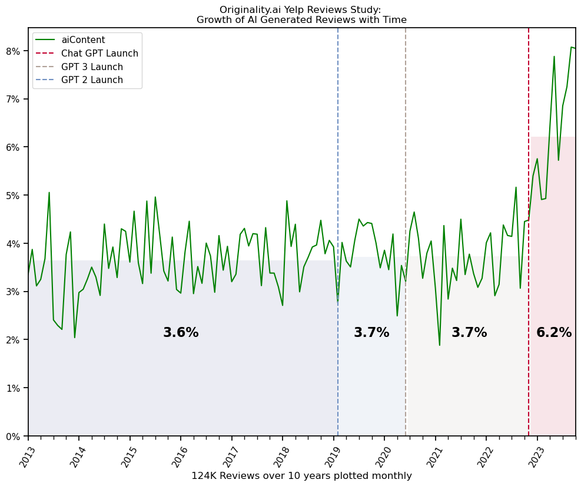
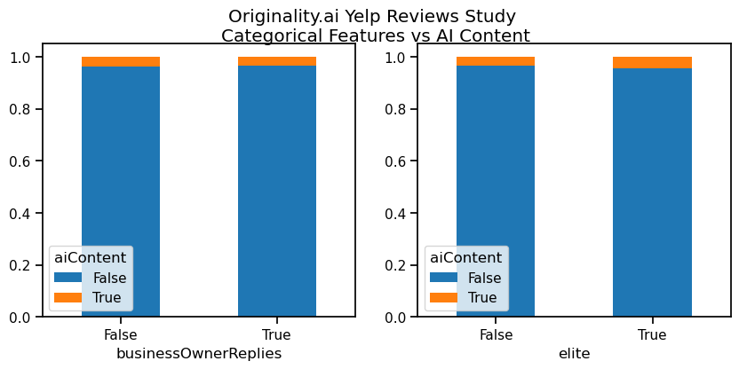

# AI Content in Yelp Reviews

Approximately 424735 records of randomly selected Yelp.com Reviews from 2005 to date were processed through [Originality.ai](https://originality.ai/) to determine the probability of AI Content. A series of experiments were performed on this data, to get more information about the relationship between the AI Content and the different features of the reviews. The purpose of the experiments in this notebook is to answer the following questions:

- Has there been an increase in aiContent in Yelp reviews since the introduction of GPT and Chat GPT?
- Is there any correlation between aiContent in Yelp reviews and the rating (stars) of each review?
- Are there any other patterns in the data?

## Methodology

- **Data collection**: 424K records from 2015 to present date were collected.
- **Preprocessing**: cleaning, filtering out non-English context, filtering out by wordcount < 100 to meet the detector's minimum requirements, removing customer sensitive-identifying information
- **Processing**: 140K records were available after preprocessing and were passed into the detector. It returns a score from 0-1, which are further labelled as True or False, with True indicating AI Content and False indicating original Content.
- **Analysis**: The 140K was then analyzed, based on the experiment objectives stated above.

## The Data

A dataset of 140,035 records over a period of 10 years, 1,652 Businesses and about 267 categories of business was available after processing.

## Results

### 1. 170% increase in AI generated reviews since Chat GPT Launch

### 2. Statistically signficant correlation between AI Content and Reviews with 5-star reviews 1.7 times likely to have AI Content than 1-star review.

### 3. Statistically significant dependecies between `aiContent`, user `friendCount` and `reviewCount` and review `reaction`. Higher user properties associate with higher `aiContent`, while higher `reaction` associates with _lower_ `aiContent`

### 4. No statistical significant dependecies between `aiContent`, user `elite` status and review `businessOwnerReplies`.

